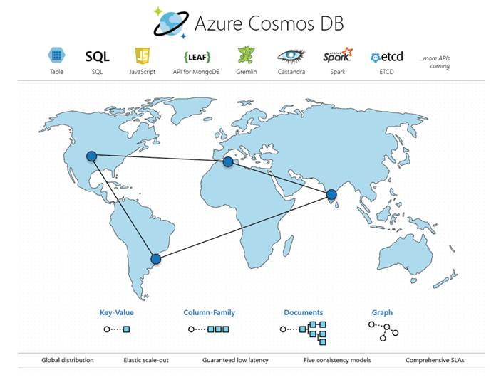

# 2. CosmosDB

## 2.1 Intro

Request Unit?

Azure Cosmos DB measures throughput using something called a request unit (RU). Request unit usage is measured per second, so the unit of measure is request units per second (RU/s). You must reserve the number of RU/s you want Azure Cosmos DB to provision in advance, so it can handle the load you've estimated, and you can scale your RU/s up or down at any time to meet current demand.

Partition key

If you continue to add new data to a single server or a single partition, it will eventually run out of space. To prepare for this, you need a partitioning strategy to scale out instead of up. Scaling out is also called horizontal scaling, and it enables you to add more partitions to your database as your application needs them.
The partition and scale-out strategy in Azure Cosmos DB is driven by the partition key, which is a value set when you create a collection. Once the partition key is set, it cannot be changed without recreating the collection, so selecting the right partition key is an important decision to make early in your development process.
In this unit, you will learn how to choose a partition key that's right for your scenario and will take advantage of the autoscaling that Azure Cosmos DB can do for you.

## 2.2 Create & Manage data

## 2.3 Query Data

[SQL language reference for Azure Cosmos DB](https://docs.microsoft.com/en-us/azure/cosmos-db/sql-api-query-reference)

## 2.4 Monitor

[Monitor](https://docs.microsoft.com/en-us/azure/cosmos-db/monitor-accounts)

## 2.5 Distribute Data Globally

[Global Disribution](https://docs.microsoft.com/en-us/azure/cosmos-db/tutorial-global-distribution-sql-api)

## (Optional) 2.6 Node.js sample app

https://docs.microsoft.com/en-us/azure/cosmos-db/sql-api-nodejs-get-started#GetSolution

